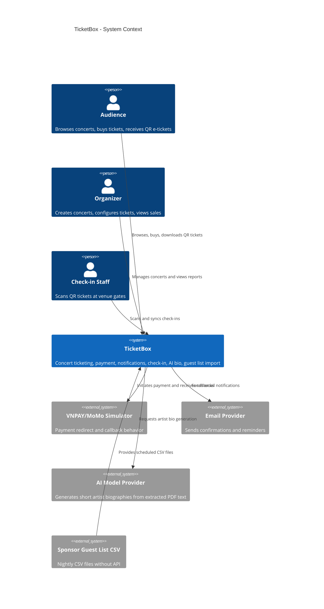
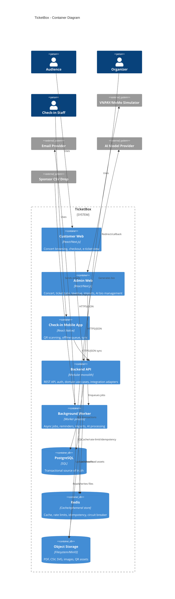

## Context

TicketBox is a course project for a concert ticketing system in Vietnam. The system must cover the complete lifecycle from concert publishing to ticket purchase, payment confirmation, QR e-ticket delivery, gate check-in, AI artist bio generation, and sponsor VIP guest list import.

The project scope is 5 weeks, so the architecture must be production-like enough to demonstrate the required engineering mechanisms while remaining feasible for a small student team. The design therefore favors a Node.js/NestJS modular monolith with strict module boundaries over distributed microservices. The codebase should still be structured around bounded contexts and ports/adapters so individual modules can be split later if needed.

Primary stakeholders:

- Audience: browse concerts, buy tickets, receive e-tickets, enter events.
- Organizer: create and manage concerts, ticket types, sale windows, limits, revenue dashboards.
- Check-in staff: scan QR tickets at the gate, including weak or offline network conditions.
- Sponsor/partner system: provides VIP guest list CSV files on a fixed schedule, with no API.
- External providers: VNPAY/MoMo-like payment gateway, email provider, AI model provider, object storage.

Key constraints from `docs/requirements.md`:

- SVIP-like ticket pools can be very small while demand is large, so the system must not oversell.
- A user limit per ticket type must hold across successful orders and concurrent requests.
- The expected spike is 80,000 visitors in 5 minutes, with 70 percent in the first minute.
- Payment failure must not take down browsing or non-payment features.
- Payment retry/callback behavior must not double-charge or double-issue tickets.
- Check-in must work when network quality is poor and later sync without losing data.
- Guest list import is one-way CSV ingestion and must tolerate bad files, duplicates, and partial failures.
- Public concert pages are read-heavy and require caching.

## Goals / Non-Goals

**Goals:**

- Produce a complete OpenSpec blueprint for the required TicketBox system within a 5-week implementation scope.
- Define all required capabilities as testable OpenSpec specs.
- Use clean architecture, hexagonal ports/adapters, and DDD-style bounded contexts inside a modular monolith.
- Specify C4 Level 1, C4 Level 2, high-level data flow, database schema, RBAC, and critical business flows.
- Specify concrete technical mechanisms for concurrency, idempotency, circuit breaker, rate limiting, caching, offline sync, CSV import, and AI processing.
- Make implementation choices that can be demonstrated locally through Docker Compose, seed data, tests, and a demo video.

**Non-Goals:**

- Deploying a real production cloud environment is out of scope.
- Integrating real production VNPAY/MoMo credentials is out of scope; the project will implement a payment gateway simulator with realistic redirect/callback, timeout, duplicate callback, and failure behavior.
- Building separate deployable microservices is out of scope for 5 weeks; module boundaries will be explicit so later extraction is possible.
- Guaranteeing perfect duplicate prevention while two or more check-in devices are offline and cannot communicate is out of scope. The system will prevent duplicates online and detect/resolve conflicts during offline sync.
- Implementing full bot detection with device fingerprinting, behavioral ML, or CAPTCHA provider integration is out of scope; rate limiting and queue/fairness controls will be implemented.
- Implementing SMS or Zalo OA delivery is out of scope; notification channels will be designed so those adapters can be added later.

## Decisions

### Decision 1: Use Node.js/NestJS modular monolith with clean/hexagonal module boundaries

TicketBox will be implemented as one Node.js/NestJS backend deployable split into bounded-context modules:

- Identity and Access
- Concert Management
- Ticket Purchase
- Payment Reliability
- Notification Delivery
- Check-in Offline Sync
- Guest List Import
- AI Artist Bio
- Platform Protection

Each module follows the same dependency rule:

```text
domain -> application/use-cases -> adapters -> infrastructure
```

Inner layers do not import ORM models, HTTP controllers, Redis clients, queue clients, or provider SDKs. External systems are accessed through ports such as `PaymentGatewayPort`, `NotificationChannelPort`, `AiBioGeneratorPort`, `ObjectStoragePort`, and `GuestListFileSourcePort`.

Rationale:

- A 5-week project benefits from one runtime, one database, and simpler debugging.
- NestJS provides modules, dependency injection, guards, interceptors, and testing conventions that fit clean/hexagonal boundaries.
- Clean boundaries keep domain logic testable without running PostgreSQL, Redis, or external APIs.
- The assignment requires many integrations and reliability patterns; ports/adapters allow realistic simulators and future real providers.

Alternatives considered:

- Microservices: closer to large-scale production, but too much operational overhead for 5 weeks.
- Simple layered CRUD app: faster initially, but business rules such as reservation, idempotency, and offline sync would leak into controllers and become hard to verify.
- Python/FastAPI or Java/Spring: viable alternatives, but the team selected Node.js/NestJS for TypeScript consistency across backend and web apps.

### Decision 2: Use PostgreSQL as the source of truth and Redis as a supporting store

PostgreSQL stores transactional data:

- users, roles, sessions
- concerts, ticket types, sale windows, seating zones
- orders, order items, payments, payment events
- tickets, QR token hashes, check-in events
- notifications and delivery attempts
- guest list batches and guest entries
- uploaded files and generated artist bios

Redis stores ephemeral or derived data:

- cache-aside data for concert list/detail
- short-TTL ticket availability snapshots
- rate limit counters/token buckets
- idempotency key records for checkout/payment initiation
- payment circuit breaker state
- background job locks

Rationale:

- Ticket inventory and payment fulfillment are consistency-critical and need SQL transactions, constraints, and row-level locks.
- Redis is appropriate for high-throughput counters and caches but should not be the only source of paid ticket truth.

Alternatives considered:

- Redis-only inventory: fast but harder to recover and audit.
- NoSQL primary store: less suitable for relational constraints across users, orders, payments, tickets, and check-ins.

### Decision 3: Reserve inventory with SQL transactions and row-level locks

The purchase flow will reserve inventory inside a PostgreSQL transaction:

1. Lock the relevant `ticket_types` row using `SELECT ... FOR UPDATE`.
2. Check sale window, remaining capacity, and requested quantity.
3. Lock/read the user's existing successful purchases for that ticket type.
4. Enforce `max_per_user`.
5. Create `orders` and `order_items` in `PENDING_PAYMENT`.
6. Increment `reserved_quantity`.
7. Commit.

Unpaid reservations expire after a configured TTL. A worker marks expired orders and releases `reserved_quantity`.

Rationale:

- This is simple to reason about and easy to demonstrate with concurrency tests.
- The database enforces the critical section for the scarce ticket pool.

Alternatives considered:

- Optimistic locking: viable, but under heavy contention many retries complicate implementation.
- Distributed Redis lock: works, but correctness then depends on lock TTL and failure timing.

### Decision 4: Use payment simulator plus idempotent payment lifecycle

Payment integration will be implemented behind a `PaymentGatewayPort`. The default adapter is a VNPAY/MoMo-like simulator that supports:

- redirect URL generation
- callback/webhook delivery
- timeout
- provider-side failure
- duplicate callback
- delayed callback

The system stores idempotency records keyed by `(user_id, idempotency_key, operation)` and payment provider references keyed by `provider_transaction_id`. Repeated requests return the first result instead of creating duplicate orders or duplicate payment attempts.

Rationale:

- The assignment requires payment reliability behavior, not real money settlement.
- Simulator behavior gives deterministic demo and tests for double-submit and gateway outage cases.

Alternatives considered:

- Pure mock success button: insufficient because it cannot demonstrate timeout, retry, duplicate callbacks, or circuit breaker.
- Real payment sandbox: useful but may slow the team with credential and network issues.

### Decision 5: Use circuit breaker and graceful degradation around payment providers

Payment gateway calls pass through a circuit breaker:

- `Closed`: normal operation.
- `Open`: provider calls are blocked after repeated failures/timeouts; checkout returns a controlled error.
- `Half-Open`: limited trial calls are allowed to test recovery.

Browsing, concert detail, admin pages, check-in, notifications already queued, CSV import, and AI processing must continue while payment is degraded.

Rationale:

- A failing provider should not exhaust backend threads or take down unrelated features.
- The assignment explicitly requires payment degradation behavior.

### Decision 6: Use cache-aside with active invalidation for read-heavy concert pages

Cache policy:

- Concert list: Redis cache-aside, TTL 60 seconds.
- Concert detail static fields: Redis cache-aside, TTL 5 minutes.
- Availability snapshot: Redis cache-aside, TTL 2 to 5 seconds, invalidated after successful reservation, expiration release, or payment completion.

Rationale:

- Concert metadata changes infrequently.
- Availability must be near real-time but does not need strict linearizability on public pages because final correctness is enforced during reservation.

### Decision 7: Use token bucket rate limiting for burst control

Rate limiting will be enforced at the backend middleware layer using Redis token buckets:

- anonymous browsing limit by IP
- authenticated checkout limit by user ID
- payment initiation limit by user ID and order ID
- admin write limit by role/user
- check-in sync limit by device ID

For sale opening spikes, checkout may also return `429` with retry-after. A waiting-room/fair-queue mechanism is explicitly a stretch goal after rate limiting is complete.

Rationale:

- Token bucket allows controlled bursts while bounding sustained request rate.
- Redis counters work across multiple backend instances in local or future deployments.

### Decision 8: Use React Native for check-in with offline event queue

The check-in app will be a React Native mobile app:

- online mode calls the check-in API immediately
- offline mode stores scan events in SQLite; AsyncStorage is limited to lightweight app/session state
- sync mode uploads batches when network returns
- server validates each event and returns per-event result

Server-side online check-in uses a unique constraint on `tickets.checked_in_at IS NULL` behavior through transactional update or a unique successful `checkin_events(ticket_id)` constraint.

Offline limitation:

- If two devices scan the same ticket while both are offline, neither device can know the other scan happened. The system will detect conflict during sync and mark one event accepted and the later/duplicate event rejected.

Rationale:

- React Native better matches the requirement for a mobile check-in app and gives more direct access to camera scanning and device storage.
- The sync contract stays independent of the mobile framework, so a future mobile client could reuse the same backend API.

### Decision 9: Use background workers for async integrations

Workers process:

- order expiration and reservation release
- email and in-app notifications
- 24-hour concert reminders
- payment reconciliation
- PDF text extraction and AI bio generation
- scheduled guest list CSV import
- cache invalidation jobs if needed

Queue technology will be Redis-backed BullMQ because the backend stack is Node.js/NestJS.

Rationale:

- BullMQ uses Redis, which is already part of the architecture for cache, rate limiting, idempotency, and circuit breaker state.
- NestJS has established integration patterns for producers, processors, retries, delayed jobs, and repeatable scheduled jobs.

Rationale:

- External calls and scheduled jobs must not block request/response paths.
- Retries, dead-letter behavior, and audit reports are easier in workers.

### Decision 10: Use object storage abstraction for uploaded and generated assets

Object storage holds:

- concert poster images
- seating map SVG files
- uploaded PDF press kits
- CSV guest list files
- generated QR image files if persisted as files

Local development can use filesystem or MinIO behind an `ObjectStoragePort`.

Rationale:

- Keeps large binary files out of PostgreSQL.
- Allows later replacement with S3-compatible storage.

### Decision 11: Use GeminiAI-compatible provider adapter with deterministic local fallback

AI Artist Bio generation will use an `AiBioGeneratorPort` with two adapters:

- GeminiAI-compatible provider adapter for demo or production-like runs
- deterministic local fallback for development and grading environments without API keys or network access

Rationale:

- The assignment requires the system to send extracted press-kit text to an AI model, but grading should not fail because credentials are unavailable.
- The fallback keeps tests and local demo deterministic while preserving the provider integration boundary.

### Decision 12: Use Redis short-TTL near-real-time availability and keep WebSocket/SSE as stretch

Ticket availability displayed on public pages will use Redis-backed near-real-time snapshots with short TTL and active invalidation. WebSocket/SSE live updates are a stretch goal, not a required baseline.

Rationale:

- Final correctness is enforced by the reservation transaction, not by the public availability number.
- Short-TTL cache reduces database pressure under high read load while keeping availability close enough for browsing.
- WebSocket/SSE adds connection management complexity that is not necessary to prove no oversell.

### C4 Level 1: System Context



### C4 Level 2: Container



### High-Level Architecture Flow

```text
Customer Web/Admin Web/React Native Check-in App
        |
        v
Backend API middleware
  - auth/session
  - RBAC
  - Redis token bucket rate limit
  - idempotency check for unsafe operations
        |
        v
Application use cases by bounded context
        |
        +--> PostgreSQL transaction for source-of-truth writes
        +--> Redis for cache, counters, idempotency, circuit breaker
        +--> Object storage for PDF/CSV/SVG/image assets
        +--> Queue for async worker jobs
        |
        v
External adapters
  - payment simulator
  - email provider
  - AI provider
  - CSV file source
```

### Critical Business Flows

#### Ticket purchase from buy click to e-ticket

```text
1. Customer selects ticket type and quantity.
2. Customer Web submits checkout request with idempotency key.
3. API authenticates user and checks rate limit.
4. API checks idempotency key. Duplicate key returns existing result.
5. Ticket Purchase use case starts PostgreSQL transaction.
6. Lock ticket type row.
7. Validate sale window, availability, and max_per_user.
8. Create pending order and order items.
9. Increment reserved_quantity.
10. Commit.
11. Payment use case requests payment URL through gateway adapter.
12. Customer completes payment in simulator.
13. Payment callback is verified and processed idempotently.
14. Order becomes PAID.
15. Tickets and QR token hashes are generated.
16. Notification jobs are enqueued.
17. Availability cache is invalidated.
18. Customer sees/downloads e-ticket QR.
```

Failure handling:

- Checkout duplicate request returns the original order/payment initiation result.
- Insufficient inventory rejects before payment.
- User limit exceeded rejects before payment.
- Payment timeout leaves order in `PAYMENT_PENDING` until reconciliation or expiration.
- Failed/expired payment releases reservation through worker.
- Duplicate payment callback is ignored after first successful fulfillment.

#### Offline check-in and sync

```text
1. Staff logs into the React Native check-in app before the event.
2. The mobile app stores session and minimal event/check-in metadata.
3. If online, scan submits ticket QR to API immediately.
4. API validates ticket, event, role, and previous check-in state.
5. API writes accepted check-in event transactionally.
6. If offline, the mobile app stores scan event locally with device_id, timestamp, and QR payload hash.
7. When network returns, the mobile app sends a batch sync.
8. API validates each event independently.
9. API returns accepted, duplicate, invalid, or conflict per event.
10. The mobile app marks synced records and shows rejected/conflict results to staff.
```

Failure handling:

- Local queue persists across page refresh.
- Sync retries use exponential backoff.
- Server rejects invalid QR tokens and tickets for another concert.
- Server accepts only one successful check-in per ticket.
- Offline duplicate across devices is detected during sync, not prevented at scan time.

#### Guest list CSV import

```text
1. Worker discovers or receives a scheduled CSV file.
2. Worker creates guest_list_import_batches record.
3. Worker validates header and file size.
4. Worker parses rows into staging records.
5. Invalid rows are recorded with reasons.
6. Valid rows are upserted by concert_id plus normalized email/phone/external_ref.
7. Duplicate rows are skipped or update non-conflicting fields.
8. Import batch is marked completed/failed/partial.
9. Admin can view import report.
10. VIP check-in can search/validate guest entries.
```

Failure handling:

- Bad file does not affect existing guest list.
- Partial row failures are isolated.
- Re-importing the same file is idempotent via file hash and row keys.

### Database Design

Core tables:

```text
users(
  id pk,
  email unique,
  password_hash,
  full_name,
  status,
  created_at,
  updated_at
)

roles(id pk, name unique)
user_roles(user_id fk, role_id fk, primary key(user_id, role_id))

concerts(
  id pk,
  title,
  slug unique,
  description,
  artist_bio,
  venue_name,
  venue_address,
  starts_at,
  ends_at,
  status,
  poster_asset_id,
  seating_map_asset_id,
  created_by,
  created_at,
  updated_at
)

ticket_types(
  id pk,
  concert_id fk,
  code,
  name,
  zone,
  price_amount,
  price_currency,
  total_quantity,
  reserved_quantity,
  sold_quantity,
  max_per_user,
  sale_starts_at,
  sale_ends_at,
  status,
  version,
  unique(concert_id, code)
)

orders(
  id pk,
  user_id fk,
  concert_id fk,
  status,
  total_amount,
  currency,
  expires_at,
  idempotency_key,
  created_at,
  updated_at,
  unique(user_id, idempotency_key)
)

order_items(
  id pk,
  order_id fk,
  ticket_type_id fk,
  quantity,
  unit_price_amount,
  currency
)

payments(
  id pk,
  order_id fk,
  provider,
  provider_transaction_id unique,
  status,
  amount,
  currency,
  idempotency_key,
  requested_at,
  completed_at,
  raw_payload
)

payment_events(
  id pk,
  payment_id fk,
  provider_event_id unique,
  event_type,
  payload,
  received_at
)

tickets(
  id pk,
  order_id fk,
  order_item_id fk,
  ticket_type_id fk,
  user_id fk,
  concert_id fk,
  qr_token_hash unique,
  status,
  issued_at,
  checked_in_at
)

checkin_events(
  id pk,
  ticket_id fk,
  concert_id fk,
  staff_user_id fk,
  device_id,
  source,
  scanned_at,
  synced_at,
  result,
  conflict_reason,
  unique(ticket_id) where result = 'ACCEPTED'
)

notifications(
  id pk,
  user_id fk,
  channel,
  type,
  status,
  subject,
  body,
  scheduled_at,
  sent_at,
  attempts
)

assets(
  id pk,
  owner_type,
  owner_id,
  kind,
  storage_key,
  content_type,
  size_bytes,
  checksum,
  created_at
)

artist_bio_jobs(
  id pk,
  concert_id fk,
  source_asset_id fk,
  status,
  extracted_text_checksum,
  generated_bio,
  error_message,
  created_at,
  completed_at
)

guest_list_import_batches(
  id pk,
  concert_id fk,
  source_asset_id fk,
  file_checksum unique,
  status,
  total_rows,
  valid_rows,
  invalid_rows,
  duplicate_rows,
  started_at,
  completed_at
)

guest_list_entries(
  id pk,
  concert_id fk,
  full_name,
  email,
  phone,
  sponsor_name,
  external_ref,
  status,
  unique(concert_id, email),
  unique(concert_id, phone),
  unique(concert_id, external_ref)
)
```

Important consistency rules:

- `ticket_types.sold_quantity + reserved_quantity <= total_quantity`.
- Paid orders generate tickets exactly once.
- A successful payment callback can fulfill an order only if the order is not already fulfilled.
- A ticket can have at most one accepted check-in event.
- Guest list import must not delete existing valid entries unless explicitly marked cancelled by CSV.

### Access Control Design

Roles:

- `AUDIENCE`: browse public data, buy tickets, view own orders/tickets.
- `ORGANIZER`: create/update/cancel concerts, manage ticket types, upload assets, view revenue for owned concerts.
- `CHECKIN_STAFF`: access check-in app and sync scans for assigned concerts/gates.
- `ADMIN`: manage users, roles, all concerts, import jobs, and system diagnostics.

Enforcement points:

- Backend API middleware verifies session/JWT and loads roles.
- Controllers declare required permissions per endpoint.
- Application use cases re-check ownership or assignment rules, such as organizer owns concert or staff is assigned to concert.
- Frontend route guards hide inaccessible screens but are not the source of truth.
- The React Native check-in app can cache session metadata, but server validates every sync request.

### API Surface

Representative endpoints:

```text
POST /auth/register
POST /auth/login
GET  /concerts
GET  /concerts/{slug}
POST /admin/concerts
PATCH /admin/concerts/{id}
POST /admin/concerts/{id}/ticket-types
POST /checkout/orders
POST /orders/{id}/payment
POST /payments/callback/{provider}
GET  /me/orders
GET  /me/tickets/{id}
POST /checkin/scan
POST /checkin/sync
POST /admin/concerts/{id}/artist-bio-jobs
POST /admin/concerts/{id}/guest-list-imports
GET  /admin/concerts/{id}/revenue
```

Unsafe endpoints require an idempotency key where duplicate submission is likely:

- `POST /checkout/orders`
- `POST /orders/{id}/payment`
- payment callback processing, keyed by provider event/transaction IDs
- CSV import job creation, keyed by file checksum

### Submission and Local Runtime

The expected local stack:

```text
docker compose up
  - backend-api
  - customer-web
  - admin-web
  - checkin-mobile
  - worker
  - postgres
  - redis
  - maildev or equivalent
  - object-storage emulator or local filesystem
```

Seed data must include:

- Anh Trai Say Hi
- Anh Trai Vuot Ngan Chong Gai
- Em Xinh Say Hi
- Chi Dep Dap Gio Re Song

Each seeded concert must include ticket types such as SVIP, VIP, GA, CAT1, CAT2 with quantities, prices, sale windows, per-user limits, and seating map zones.

## Risks / Trade-offs

- [Risk] Five weeks is short for all required features. -> Mitigation: use NestJS modular monolith, payment simulator, React Native check-in with a narrow sync contract, and prioritize correctness of required mechanisms over microservice deployment.
- [Risk] SQL row locks can become a bottleneck on hot SVIP ticket types. -> Mitigation: this is acceptable for correctness in the assignment; load tests should show no oversell. Future scaling could introduce queue-based sale admission or sharded inventory counters.
- [Risk] Cached availability can briefly differ from real inventory. -> Mitigation: final availability is checked inside the reservation transaction; public availability is labeled as near real-time.
- [Risk] Offline check-in cannot globally prevent duplicates while devices are isolated. -> Mitigation: document the limitation, prevent duplicates online, persist offline scans, and detect conflicts on sync.
- [Risk] Payment simulator may be seen as less realistic than real gateway integration. -> Mitigation: implement real gateway behaviors that matter for the assignment: timeout, duplicate callback, delayed callback, failure, idempotency, and circuit breaker.
- [Risk] AI model provider may require credentials or network access. -> Mitigation: define an AI adapter with configurable provider and deterministic local fallback for development; clearly document which mode is used in demo.
- [Risk] CSV import can corrupt guest list if a bad file overwrites good data. -> Mitigation: stage rows, validate before upsert, record import reports, and make imports idempotent by file checksum and row natural keys.
- [Risk] Team members can accidentally bypass module boundaries. -> Mitigation: document dependency rules, use ports/adapters, and require use-case tests with in-memory adapters for critical business logic.

## Spec Semantics

After `define-ticketbox-blueprint` is archived normally, `openspec/specs/` becomes the accepted target system contract for TicketBox. These main specs define the behavior, architecture expectations, and engineering mechanisms the project must eventually satisfy.

The presence of a capability in `openspec/specs/` does not mean that capability has already been implemented. Implementation completion is tracked separately through future implementation changes, task checklists, tests, pull requests, and `docs/roadmap.md`.

Future implementation changes should reference the relevant target specs instead of redefining the same requirements. For example, an `implement-ticket-purchase` change should reference the archived `ticket-purchase` spec, then define the concrete database migrations, use cases, adapters, UI work, and tests needed to satisfy that target contract.

If implementation reveals that the accepted target behavior or architecture is wrong, the team should create or update an OpenSpec change that explicitly modifies the relevant specs or design decisions. The team should not silently let implementation drift away from the archived contract.

## Migration Plan

This is an initial blueprint change, so there is no production migration. Implementation should proceed through separate OpenSpec changes:

1. `implement-platform-foundation`
2. `implement-identity-access`
3. `implement-concert-management`
4. `implement-ticket-purchase`
5. `implement-payment-reliability`
6. `implement-platform-protection`
7. `implement-notification-ai-guest-list`
8. `implement-checkin-offline-sync`
9. `harden-submission-readiness`

Rollback for this blueprint means reverting or archiving a replacement OpenSpec change before implementation starts.

## Implementation Roadmap Reference

The official 5-week team implementation roadmap is maintained in `docs/roadmap.md`. This blueprint defines the target system and acceptance-level behavior; implementation work should be split into smaller OpenSpec changes that follow that roadmap instead of applying `define-ticketbox-blueprint` as a whole-system coding change.

## Open Questions

- None. The team has resolved the remaining provider and local persistence decisions for the blueprint.
