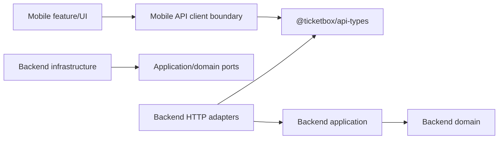
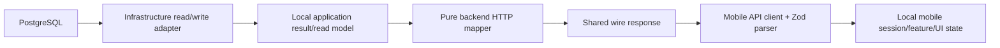

# Shared API Contracts

## Ownership and scope

`@ticketbox/api-types` is the canonical, framework-independent package for the public HTTP contracts currently shared by the backend and the check-in mobile app:

- token-only login request/response;
- authenticated public profile and `RoleCode` values;
- active check-in staff assignment list;
- online scan request and status-discriminated business response.

The package exports Zod schemas, types inferred from those schemas, and stable public code values through its package root. It does not export backend domain entities, application services, Prisma models/enums, NestJS types, mobile network/storage implementations, React Native components, or feature/UI states. Concert, TicketType, Order, and offline batch-sync contracts are outside this change.

## Compile-time dependency graph

In this diagram, `A --> B` means **A imports or depends on B**.



`@ticketbox/api-types` is a dependency leaf. Backend domain/application layers do not import it. The Checkin assignment query depends on a Checkin-owned `StaffAssignmentQueryPort`; only the Prisma read adapter sees assignment/concert persistence records.

## Runtime response-flow graph

In this diagram, `A --> B` means **runtime data flows from A to B**. It does not imply a source import.



## Authentication and profile flow

The canonical startup flow is:

```text
POST /auth/login -> { accessToken }
GET /me/profile with Bearer token -> { id, email, displayName, roles }
GET /checkin/assignments with Bearer token -> StaffAssignment[]
```

Profile field sources are intentionally split:

- `id` and `roles` come from the already verified JWT principal;
- `email` and `displayName` come from a safe database projection by that user ID.

Profile loading does not reload persisted role relations and does not change `JwtStrategy`, `RolesGuard`, token claims, expiration, or protected-route authorization behavior.

## Staff assignment query

`GET /checkin/assignments` is owned by Checkin and protected by JWT plus `CHECKIN_STAFF`. It accepts no staff ID parameter, uses the authenticated JWT user ID, filters `ACTIVE` assignments, and returns a raw JSON array (`[]` when empty). The infrastructure adapter projects current concert title/start time for display.

Identity still owns role and assignment authorization/management. Concert Management still owns concert business behavior. Selecting an assignment never replaces scan-time ownership, active-status, concert, and gate validation.

## Online scan mapping

The business response contains only:

- `accepted` with required `ticketId` and `checkedInAt`;
- `duplicate` with optional ticket/check-in metadata;
- `invalid` with an invalid-ticket reason code;
- `unassigned` with an assignment reason code.

HTTP `401`/`403` are classified by status before success-schema parsing and map to mobile-local `unauthorized`. Network failure and service failure map to mobile-local `network-error` and `unavailable`. Loading, submitting, debounce, scanner/camera state, session persistence, and recoverable errors remain local to mobile.

Every scan requires a trimmed, non-empty `deviceId` no longer than 160 characters. Mobile stores a random installation UUID under a dedicated Expo SecureStore key and reuses it across restart and logout/login. If reading, generating, or persisting that identifier fails, scanner submission is blocked with a recoverable local error; no fixed fallback or hardware serial is used.

## Validation strategy

Zod schemas in `@ticketbox/api-types` are canonical for scoped wire contracts. Mobile validates all successful scoped responses at the API-client boundary. Backend uses local invariant-bearing application types and deterministic pure response mappers; mapper outputs are parsed in contract tests. Scan responses are not runtime-parsed after a transaction commits.

NestJS `class-validator` remains in place for request DTOs. Online scan DTO parity tests verify the same trim, required, non-empty, and 160-character `deviceId` behavior as the shared Zod request schema.

## Migration and verification record

Migration completed in this order:

1. inventory existing wire types, callers, and payload drift;
2. add and build `@ticketbox/api-types`;
3. add schema, mapper, parity, and dependency-boundary tests;
4. migrate backend profile/scan adapters and add the Checkin assignment read endpoint;
5. migrate the mobile client and installation-ID provider;
6. remove duplicate wire definitions while retaining local domain and UI state;
7. run package, backend, mobile, integration, build, runtime-resolution, lint, and OpenSpec checks.

Verification commands:

```powershell
npm.cmd run build:api-types
npm.cmd run test:api-types
npm.cmd run verify:api-boundaries
npm.cmd run verify:checkin-mobile
npm.cmd run build
$env:SKIP_DB_TESTS='1'; npm.cmd test
npm.cmd run lint
$env:CI='false'; Remove-Item Env:SKIP_DB_TESTS -ErrorAction SilentlyContinue; npx.cmd vitest run test/auth/auth.e2e-spec.ts test/checkin/checkin.e2e-spec.ts --maxWorkers=1 --hookTimeout=60000
openspec.cmd validate establish-shared-api-types --strict
```

The compatibility suite includes a real Nest HTTP server and the real mobile HTTP client for login, profile, active assignments, assignment selection, online scan submission, response validation, and local result mapping. Fake mobile clients remain useful only for isolated feature tests.

Verified on 2026-06-20:

- shared schemas: 20 tests passed;
- mobile application typecheck and tests: 35 tests passed, including startup restoration and scanner readiness/retry coverage;
- focused backend DTO/shared-schema parity and response-contract tests: 14 tests passed;
- real Nest HTTP/mobile-client integration: 10 tests passed;
- root non-database suite: 218 tests passed and 39 database-dependent tests skipped;
- backend build, lint, package typecheck, dependency-boundary check, package-root Node resolution, and Android Expo/Metro export passed.

The database-backed auth and check-in E2E suites were also executed live against the local PostgreSQL seed: 2 files and 15 tests passed. This covers profile enrichment, assignment listing, invalid-device side effects, and accepted/duplicate scan results. The broader root suite still uses `SKIP_DB_TESTS=1` so these stateful E2E cases run once in their dedicated verification step.

No compatibility aliases remain for the migrated wire types. Local backend domain/application result/read-model types and local mobile session/transport/UI types intentionally remain.

## Rollback

Rollback in reverse migration order:

1. restore mobile client-local wire aliases and the previous client flow;
2. restore backend adapter-local response aliases while leaving domain logic and database schema unchanged;
3. remove the assignment read endpoint/profile enrichment if required;
4. remove `@ticketbox/api-types` only after consumers no longer import it.

The profile fields and staff assignment endpoint are additive and may remain during a partial rollback. There is no database migration to reverse. Do not delete the old compatibility layer until the affected consumer passes its build and contract tests.
