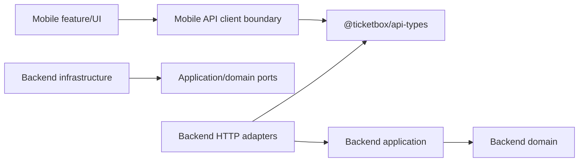
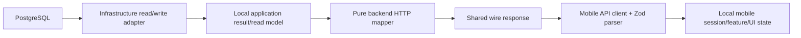

# Shared API Contracts

> **Source of truth has moved.** The behavioral contract for `@ticketbox/api-types`
> (login, profile, staff assignments, online scan, batch sync) now lives in
> **`openspec/specs/shared-api-contracts/spec.md`**. Day-to-day guidance for the package is in
> **[`packages/api-types/CLAUDE.md`](../packages/api-types/CLAUDE.md)**. Do not re-document the
> contract here — update the spec instead.
>
> This file retains only what is **not** in the spec: the compile-time/runtime dependency
> diagrams and the one-time migration/verification record (historical evidence).

## Dependency & data-flow diagrams

Compile-time (`A --> B` = A imports/depends on B). `@ticketbox/api-types` is a **dependency leaf**;
backend domain/application layers never import it.



Runtime response flow (`A --> B` = data flows A → B; not an import):



## Migration & verification record (historical, 2026-06-20)

The original `establish-shared-api-types` migration extracted duplicated wire types into the package
and verified backend ↔ mobile contract parity. Verification commands kept for reference:

```powershell
npm.cmd run build:api-types
npm.cmd run test:api-types
npm.cmd run verify:api-boundaries
npm.cmd run verify:checkin-mobile
npm.cmd run build
$env:SKIP_DB_TESTS='1'; npm.cmd test
npm.cmd run lint
$env:CI='false'; Remove-Item Env:SKIP_DB_TESTS -ErrorAction SilentlyContinue; npx.cmd vitest run test/auth/auth.e2e-spec.ts test/checkin/checkin.e2e-spec.ts --maxWorkers=1 --hookTimeout=60000
openspec.cmd validate establish-shared-api-types --strict
```

Verified result: shared schemas 20 tests; mobile typecheck + 35 tests; backend DTO/parity 14 tests;
real Nest/mobile integration 10 tests; root non-DB suite 218 passed / 39 DB-skipped; plus the live
PostgreSQL auth + check-in E2E suites (2 files, 15 tests). No compatibility aliases remain; local
backend domain/application and mobile session/UI types intentionally stay local.

**Rollback** (reverse migration order): restore client-local wire aliases → restore backend
adapter-local response aliases → remove the assignment read endpoint/profile enrichment if required →
remove `@ticketbox/api-types` only after no consumer imports it. The profile fields and assignment
endpoint are additive and may remain during a partial rollback; there is no DB migration to reverse.
