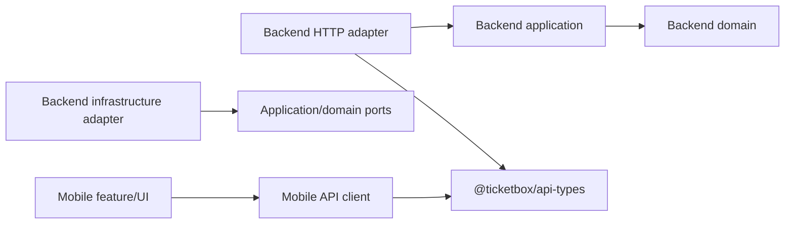
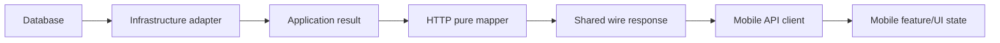

## Context

TicketBox is an npm workspace with a NestJS modular-monolith backend and a React Native check-in app. Both are TypeScript, but their HTTP boundary types are currently independent:

- `apps/checkin-mobile/src/api/checkin-mobile-api.types.ts` defines `StaffRole`, a login response with embedded `profile`, assignment types, and a scan result union that mixes backend business results with mobile-only transport/UI states.
- `packages/backend` defines domain `Role`, application result types, NestJS DTOs, and check-in domain types. `POST /auth/login` currently returns `{ accessToken }`; `GET /me/profile` returns only `{ id, roles }`; `POST /checkin/scan` returns the four business statuses; no staff-facing `GET /checkin/assignments` route exists.
- The accepted `auth-login` spec agrees with the token-only implementation, while `checkin-mobile-app` assumes login returns token plus profile. The blueprint only requires a usable token/session and does not require an embedded profile.

The shared package must own only public HTTP wire contracts. Backend domain/application layers remain independent, PostgreSQL and backend behavior remain authoritative, and migration must not broaden authorization or refactor all NestJS validation.

## Goals / Non-Goals

**Goals:**

- Establish `@ticketbox/api-types` as the canonical source for the scoped HTTP request/response shapes, public API codes, and framework-independent runtime schemas.
- Resolve the login mismatch without changing the existing successful login response: login returns a token, then the client loads the authenticated profile.
- Enrich the public profile without changing authorization semantics: profile identity and roles use the verified JWT principal, while only public display fields are loaded from persistence.
- Provide the missing active-assignment listing contract for the authenticated check-in staff member.
- Require a stable installation-scoped `deviceId` on every online scan request so online audit records and later offline-sync events share one device identity convention.
- Separate backend business results from HTTP authorization failures and mobile transport/feature/UI state.
- Give backend HTTP adapters and the mobile API client one tested compatibility boundary while preserving clean-architecture dependency direction.
- Migrate in small, reversible stages and remove duplicate types only after all usages and integration tests pass.

**Non-Goals:**

- Sharing backend domain entities, domain services, use cases, ports, Prisma models/enums, controllers, guards, decorators, repositories, network clients, React Native components, stores, or UI state.
- Moving backend `Role` or persisted `RoleCode` into the shared package; public `RoleCode` is a separate wire-level concept even though values currently match.
- Changing JWT validation, bearer-token authorization, the source or freshness policy of authorization roles, `CHECKIN_STAFF` enforcement, assignment ownership/concert/gate validation, server-side QR validation, accepted-check-in atomicity, database schema, or persisted enum values.
- Adding contracts for Concert, TicketType, Order, offline batch sync, or unrelated domains.
- Replacing `class-validator` throughout the backend.

## Decisions

### 1. The shared package is a leaf HTTP-contract workspace

Create exactly this initial structure:

```text
packages/api-types/
  package.json
  tsconfig.json
  src/
    index.ts
    auth/
      auth.contract.ts
    checkin/
      assignment.contract.ts
      online-scan.contract.ts
```

`package.json` uses the name `@ticketbox/api-types`. The root `src/index.ts` explicitly exports the supported schemas, inferred types, and code-value constants; consumers do not deep-import internal files. The package depends on Zod but not NestJS, React Native, Prisma, or application workspaces.

The package is a compiled workspace package rather than a source-export package. Its TypeScript build emits runtime JavaScript, declarations, and source maps into `dist/`; its root `exports` entry exposes only the matching `dist` JavaScript and declaration entrypoints. `dist/` is generated output and `src/` remains private package implementation. Root development, build, test, and verification commands that consume the package must build `@ticketbox/api-types` first. Verification must cover package-root imports in the NestJS build/runtime path and the Expo Metro bundle path so neither consumer relies on a TypeScript source deep import or a repository-only path alias.

Compile-time dependency direction uses the rule `A --> B` to mean **A may import or depend on B**:



`@ticketbox/api-types` is a dependency leaf for the scoped HTTP boundary: backend HTTP adapters and the mobile API client may import it, but it imports neither backend nor mobile code. Backend domain/application layers do not import the shared package, HTTP controllers, NestJS infrastructure, Prisma, or mobile code. Mobile feature/UI code depends on its local API-client boundary; the mobile API client may consume the shared contracts.

Runtime response flow is a separate concept. Here `A --> B` means **data produced by A flows to B while the system runs**, not that A imports B:



Keeping these diagrams separate prevents runtime data direction from being mistaken for source-code dependency direction. Repository dependency checks enforce the compile-time graph rather than inferring architecture from data flow.

Alternative considered: place all shared types in the backend package. Rejected because that makes mobile depend on a server module and risks exposing domain/infrastructure types.

### 2. Package contracts and local-only types are intentionally separated

The initial public contracts are:

| File | Canonical wire contracts |
| --- | --- |
| `auth/auth.contract.ts` | `RoleCode`, `LoginRequest`, token-only `LoginResponse`, `StaffProfileResponse` with `id`, `email`, `displayName`, and `roles` |
| `checkin/assignment.contract.ts` | active assignment response item and a raw-array response schema `StaffAssignment[]` with `assignmentId`, `concertId`, `concertTitle`, optional `gate`, optional `startsAt`, and `status: ACTIVE` |
| `checkin/online-scan.contract.ts` | online scan request; a status-discriminated business response union for `accepted`, `duplicate`, `invalid`, and `unassigned`; stable reason codes and status-specific metadata requirements |

The following stay local:

- Backend: `Role`, authenticated actor, use-case commands/results, ticket records, repository records/ports, persisted result enums, dates and ORM mappings. Local status-discriminated result types must still encode existing invariants, including required `ticketId` and `checkedInAt: Date` for an accepted result.
- Mobile: `MobileSession`, `AuthState`, assignment loading/selection states, `unauthorized`, `network-error`, `unavailable`, loading/submitting/recoverable-error states, camera state, storage interfaces, and network-client implementation.

Wire timestamps are ISO-8601 strings. Backend adapters map application `Date` values and internal names such as `gateName`/`id` to wire `checkedInAt`, `gate`, and `assignmentId`. Mobile maps parsed wire values into local session and feature states.

`OnlineScanRequest.deviceId` is required, trimmed, non-empty, and at most 160 characters to match the existing persistence column. It identifies the mobile app installation, not the authenticated user and not a hardware serial number. Mobile owns an asynchronous `getOrCreateInstallationId(): Promise<string>` provider backed by Expo SecureStore. The provider reads one dedicated installation-ID key, returns the existing valid value across app restarts and user logout/login, or creates a random UUID and persists it when the key is missing or invalid. Scanner readiness and submission wait for this asynchronous initialization; if no valid identifier can be obtained or persisted, mobile blocks submission with a recoverable local error rather than using a fallback constant or sending a contract-invalid request. The app and scanner UI start in `initializing`, do not display or enable scanner-ready submission until initialization succeeds, disable submission while `initializing` or `submitting`, and retry a failed installation setup by calling `initialize()` again rather than calling a synchronous state-only reset. Backend request validation trims the incoming string and applies the same required, non-empty, and 160-character limit as the canonical Zod schema before the use case runs or any check-in event is written. Existing in-repository callers are migrated in this change with no optional compatibility window.

Online scan responses are a discriminated union rather than one flat object with universally optional metadata:

| Status | Required fields | Optional fields |
| --- | --- | --- |
| `accepted` | `status`, `message`, `ticketId`, `checkedInAt` | `checkinEventId` |
| `duplicate` | `status`, `message` | `ticketId`, `checkedInAt`, `checkinEventId` |
| `invalid` | `status`, `message`, an invalid-ticket `reasonCode` | `ticketId`, `checkinEventId` |
| `unassigned` | `status`, `message`, an assignment `reasonCode` | `checkinEventId` |

The invalid-ticket reason-code set is `INVALID_TICKET`, `WRONG_CONCERT`, and `TICKET_NOT_ISSUED`. The assignment reason-code set is `REVOKED_ASSIGNMENT` and `ASSIGNMENT_MISMATCH`. Optional JSON fields are omitted when unavailable rather than emitted as `null`. This prevents a payload such as `{ status: 'accepted', message: '...' }` from passing validation without the ticket identifier and accepted timestamp required by the accepted check-in specification.

Alternative considered: export `MobileSession` and the full current `OnlineScanResultStatus` union. Rejected because storage and transport/UI behavior are client concerns, not server guarantees.

### 3. Login remains token-only and profile loading becomes explicit

Canonical authenticated startup is:

```text
POST /auth/login -> { accessToken }
GET /me/profile with Bearer token -> { id, email, displayName, roles: RoleCode[] }
GET /checkin/assignments with Bearer token -> raw JSON array of active assignments
```

This resolves the accepted-spec conflict in favor of `auth-login`, the current backend implementation, and the blueprint's token/session requirement. The `checkin-mobile-app` requirement is modified explicitly rather than changing login to fit the mobile fake contract.

Profile enrichment preserves the existing authorization snapshot:

```text
Verified JWT principal             Safe profile projection
  id ------------------------+       email -------------------+
  roles ---------------------+-----> public profile response  |
                                     displayName --------------+
```

`id` and `roles` come from the `AuthenticatedUser` already produced by the current `JwtStrategy`. A purpose-built profile query loads only `email` and `displayName` by that authenticated user ID. The query does not load role relations, and the HTTP adapter must not replace, merge, or compare the JWT roles with database roles. `JwtStrategy`, `RolesGuard`, token issuance, token claims, expiration behavior, and all protected-route authorization remain unchanged. Database-backed live role revalidation is explicitly deferred to a separate security change.

Mobile creates its local `MobileSession` only after both token and profile have validated, and blocks non-`CHECKIN_STAFF` profiles locally using the same JWT role snapshot that backend guards use for that session.

Application startup must invoke the existing session controller rather than merely define restore behavior in an isolated class. It begins with auth state `restoring` and scanner state `initializing`, restores the persisted mobile session, and initializes the installation ID. When a valid `CHECKIN_STAFF` session is restored, the app updates authenticated state and loads that session's active assignments without another login. Missing sessions return to `unauthenticated`; blocked or failed restoration must not start assignment loading. Session restoration and installation-ID initialization may run concurrently because they update separate state, but scanner submission remains unavailable until installation initialization succeeds.

Alternative considered: expand `POST /auth/login` to include `profile`. Rejected because no accepted auth requirement mandates it, it would change an already implemented response, and it couples credential authentication to a check-in-specific client need.

### 4. Add a staff-self assignment endpoint without changing policy

Add authenticated `GET /checkin/assignments`, guarded by JWT and `CHECKIN_STAFF`, as a Checkin bounded-context query. It derives `staffUserId` from the verified JWT and returns only that user's active assignments as a raw JSON array; an empty result is `[]`, never an envelope such as `{ assignments: [] }`. The client cannot submit a different staff ID.

Ownership and dependency shape:

```text
Checkin HTTP adapter
        |
        v
ListMyCheckinAssignmentsQuery
        |
        v
StaffAssignmentQueryPort          (Checkin inner-layer port)
        ^
        |
PrismaStaffAssignmentQueryAdapter (Checkin infrastructure)
        |
        +-- read checkin_staff_assignments
        +-- read concerts title/startsAt
```

The Checkin-local query read model contains only the fields needed by the staff workflow: `assignmentId`, `concertId`, `concertTitle`, optional `gate`, optional `startsAt`, and `ACTIVE` status. Its Prisma infrastructure adapter may perform a read-only projection across assignment and concert tables, but Checkin application code depends only on `StaffAssignmentQueryPort` and does not import Prisma, the Identity assignment repository, or Concert Management domain/application types.

Identity retains ownership of users, roles, assignment management, and assignment authorization. Concert Management retains ownership of concert write/business behavior. The cross-table projection is a Checkin read model and does not relocate either domain's entities or rules.

This route is distinct from `GET /admin/concerts/:concertId/staff`, which remains organizer/admin-facing and concert-scoped. Scan submission continues to revalidate assignment ownership, concert, gate, and active status; assignment listing is not authorization proof by itself.

Alternatives considered:

- Reuse the admin list route. Rejected because it has different actors, scope, and authorization semantics.
- Add concert presentation fields to the Identity assignment repository/use case. Rejected because it makes Identity depend on Checkin UI needs and Concert read data.
- Orchestrate separate Identity and Concert application calls per assignment. Rejected for this scoped modular-monolith read path because it adds coordination and potential N+1 queries without improving business-rule ownership.

### 5. Online scan business responses do not contain transport or UI states

The shared response discriminant contains only `accepted`, `duplicate`, `invalid`, and `unassigned`. HTTP `401`/`403` remain failed HTTP responses and the mobile API client classifies them by HTTP status before attempting success-schema parsing. Their response body is not added to `@ticketbox/api-types`: the client may extract a display message tolerantly when the existing NestJS body contains either a string or string array, but authorization mapping must not depend on an exact error-body schema. Connection failure maps to `network-error`; missing/unavailable service maps to `unavailable`. Feature code continues to own submitting, debounce, and camera state.

Mapping is explicit:

| Source | Shared HTTP contract | Mobile local state |
| --- | --- | --- |
| Accepted backend application result | `accepted` | accepted result presentation |
| Already checked in/concurrent loser | `duplicate` | duplicate result presentation |
| Invalid QR/wrong concert/not issued | `invalid` plus reason code | invalid result presentation |
| Assignment missing/revoked/mismatch | `unassigned` plus reason code | unassigned result presentation |
| HTTP 401/403 | no business result | `unauthorized` |
| fetch/network failure | no API response | `network-error` |
| endpoint/service unavailable | no API response | `unavailable` |

Alternative considered: preserve the mobile union as the shared response. Rejected because it permits the backend to appear to return states it cannot observe and blurs authorization failures with successful HTTP business responses.

### 6. Zod is canonical for scoped wire validation; NestJS migration remains narrow

Each public contract exports a Zod schema and a TypeScript type inferred from that schema. This makes runtime validation and compile-time shape derive from one wire definition. The online scan response uses a Zod discriminated union keyed by `status`, so each business outcome enforces its own required metadata and reason-code subset.

- Mobile parses every login, profile, raw-array assignment, and scan success payload at the API-client boundary before feature code receives it. HTTP failures are classified by status before success-schema parsing; `401`/`403` mapping tolerates the existing NestJS error body and does not require a shared error schema.
- Backend HTTP adapters use pure, typed mappers to convert domain/application results into shared wire response types. Mapper outputs are parsed with the corresponding Zod schemas in contract tests.
- The side-effecting `POST /checkin/scan` route does not add a runtime response-schema `parse()` after the check-in transaction has completed. Its local persistence/application accepted-result variant must already require `ticketId` and `checkedInAt: Date`; the mapper performs only deterministic field renaming, optional-field omission, and `Date`-to-ISO conversion.
- Existing NestJS DTOs and `class-validator` remain for request binding during the controlled migration. Their scoped request constraints and normalization must match the shared Zod request schemas, with parity tests covering valid and invalid fixtures. New semantic wire constraints are added to the shared schema first; the mirrored DTO constraint is updated in the same change.
- For `OnlineCheckinDto.deviceId`, parity specifically requires trimming before validation plus a non-optional, non-empty string with a 160-character maximum. The validated trimmed value is passed to the use case. This intentional tightening aligns the implementation with the accepted mobile/check-in contract and is not a repository-wide validation refactor.
- For optional `OnlineCheckinDto.gate`, parity requires omission to remain valid, surrounding whitespace to be trimmed before command mapping, and a blank-after-trim value to be rejected exactly as the canonical Zod request schema rejects it.
- No Zod schema imports domain or infrastructure types. No broad custom pipe or repository-wide DTO rewrite is introduced.

This temporarily duplicates request enforcement mechanics, but not ownership: Zod is the canonical wire rule and parity tests detect drift while `class-validator` preserves current NestJS behavior.

Backend response correctness is enforced through local invariant-bearing result types, shared response types, pure mapper tests, and Zod contract fixtures. Mobile remains the runtime trust boundary for received network payloads and parses every successful response with Zod. If an unexpected response-mapping defect ever occurs after a check-in commit, it is an operational server-contract failure and must never be interpreted as rolling back or undoing the already committed check-in.

Alternative considered: replace all NestJS DTO validation with a Zod pipe. Rejected as an unrelated, high-churn refactor.

### 7. Compatibility is verified across the real HTTP boundary

Tests include package schema/type fixtures, backend adapter contract tests, mobile API client runtime-validation and error-mapping tests, dependency-boundary checks, and at least one integration test using the real backend HTTP routes and real mobile HTTP client for:

```text
login -> fetch profile -> list active assignments -> select assignment
      -> submit online scan -> parse and map result
```

The integration test uses controlled persistence/fixtures but not a fake mobile API client. Existing backend atomic duplicate tests and authorization tests remain authoritative for business correctness.

## Risks / Trade-offs

- [Risk] Zod plus temporary `class-validator` annotations can drift. -> Mitigation: treat Zod as canonical, keep the overlap only on scoped request DTOs, and require parity fixtures before deletion or alteration.
- [Risk] Adding `email` and `displayName` to profile requires a persistence query and could accidentally change role semantics if role relations are loaded too. -> Mitigation: load a projection containing only `email` and `displayName`, compose `id` and `roles` from the verified JWT principal, and add tests where stored roles differ from JWT roles to prove no reauthorization occurs.
- [Risk] Assignment response needs concert presentation fields and could make Identity depend on Concert or mobile presentation needs. -> Mitigation: place a purpose-built query port and read model in Checkin, implement the cross-table projection only in Checkin infrastructure, and keep Identity assignment/authorization and Concert business types unchanged.
- [Risk] Runtime response parsing after an accepted check-in commit could return an error to mobile even though the database side effect succeeded. -> Mitigation: require accepted metadata in the local result type, keep the response mapper pure and deterministic, validate every mapper variant with Zod in contract tests, and do not add a post-commit runtime response-schema parse to `POST /checkin/scan`.
- [Risk] Existing tests, scripts, or callers may rely on the backend's current optional `deviceId`. -> Mitigation: inventory every caller first, migrate all in-repository payloads and fixtures in the same change, reject invalid requests before side effects, and verify HTTP `400` behavior explicitly; no optional compatibility period is retained.
- [Risk] Workspace/build tooling may resolve source differently between NestJS and Expo. -> Mitigation: compile the package to `dist`, expose only matching JavaScript/declaration root exports, build it before consumers, prohibit source deep imports/path-alias shortcuts, and verify both NestJS runtime resolution and an Expo Metro bundle.
- [Risk] SecureStore access is asynchronous and can fail, while the existing scan workflow expects a synchronous constant. -> Mitigation: initialize through `getOrCreateInstallationId(): Promise<string>` before scanner readiness, persist one random UUID per installation, reuse it across sessions, and expose a recoverable local error without submitting when initialization or persistence fails.
- [Risk] Controller-level restore and installation-ID tests can pass while the application root never invokes them or exposes an incorrect ready state. -> Mitigation: add an app-startup orchestration test, initialize auth/scanner state explicitly, load assignments after a restored staff session, and assert scanner controls and retry behavior from rendered state.
- [Risk] Removing old mobile/backend types too early can hide unmigrated usages. -> Mitigation: inventory imports first, migrate both sides, run the full compatibility suite, then delete duplicates in a separate task.
- [Trade-off] The two-step login/profile flow adds one authenticated request after login. It preserves the accepted login contract and allows profile evolution independently; restored sessions can continue using persisted validated profile data and refresh it according to mobile policy.

## Migration Plan

1. Inventory every current auth, profile, assignment, and scan wire type/consumer, identify every scan caller or fixture that omits `deviceId`, and lock observed behavior with fixtures.
2. Add and build `@ticketbox/api-types` into `dist`; introduce schemas, inferred types, controlled root exports, build-before-consumer ordering, and package/runtime-resolution tests without changing consumers.
3. Add backend mapping/contract tests, expand `GET /me/profile` by composing verified-JWT `id`/`roles` with persistence-projected `email`/`displayName`, and add guarded `GET /checkin/assignments` through a Checkin query port plus Checkin infrastructure read projection; keep Identity and Concert business ownership unchanged, keep inner layers free of Prisma/shared-package imports, and do not alter JWT/guard behavior.
4. Tighten local scan result invariants, require and bound `deviceId` in both shared Zod request schema and `OnlineCheckinDto`, then migrate `POST /auth/login` and `POST /checkin/scan` HTTP adapters to typed pure shared-response mappers with Zod-validated contract tests while retaining existing business behavior; do not add post-commit runtime response parsing to the scan route.
5. Migrate the mobile API client to login then profile, wire persisted-session restoration into application startup followed by assignment loading, validate the raw assignment array and other successful scoped responses, provision the SecureStore-backed asynchronous installation ID before scanner-ready UI or submission, and map HTTP/transport failures into local states by status.
6. Run package, backend, mobile, HTTP contract, integration, NestJS runtime-resolution, Expo Metro bundle, build, typecheck, lint, and dependency-boundary checks.
7. Remove duplicate wire types only after the inventory shows no remaining consumer and all checks pass; update architecture documentation.

Rollback is staged in reverse: restore mobile imports/local types, restore backend adapter-local response aliases while keeping domain logic unchanged, then remove the workspace package. The additive profile fields and assignment endpoint may remain safely during rollback; no database rollback is required. If a consumer migration fails, do not delete the old types and revert only that consumer stage.

## Open Questions

- None for the scoped online scan response. Status-specific required fields are fixed above, and optional scan metadata uses omission rather than `null`; implementation inventory must verify current serializers and mappers conform before aliases are deleted.
